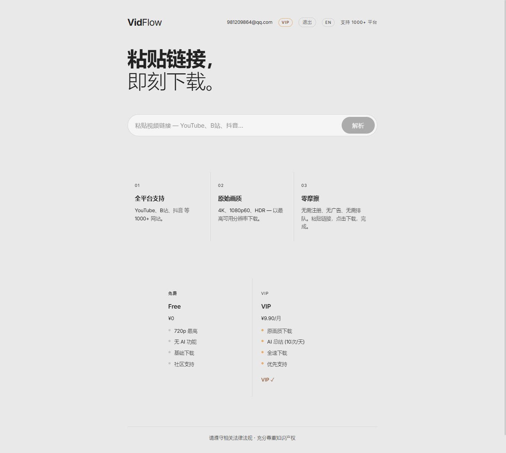
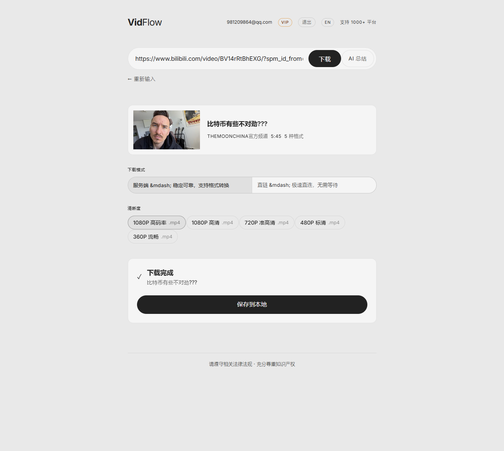
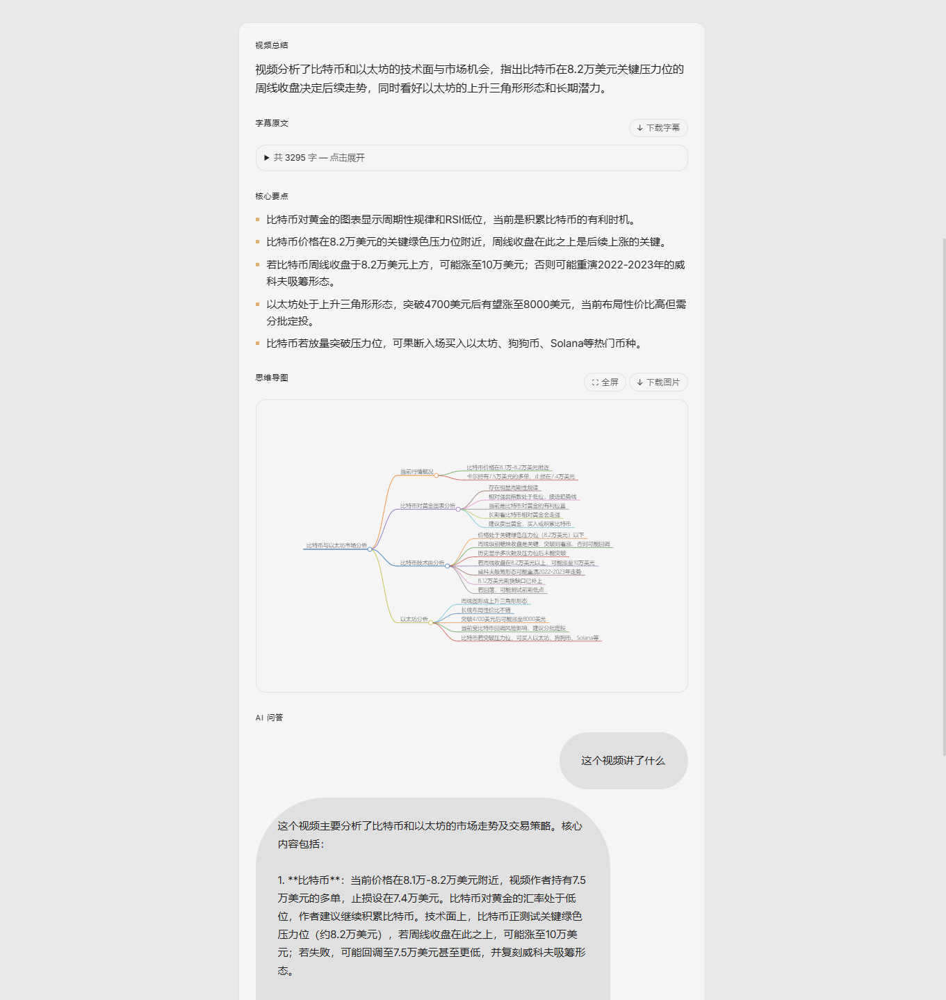

# VidFlow - 万能视频下载器

> 从 YouTube、B站、抖音、Twitter 等 1000+ 网站下载视频，支持 AI 视频总结。

## 功能

- **全平台下载** — 支持 1000+ 网站，4K / 1080p60 / HDR 原画质
- **AI 视频总结** — 字幕提取 → AI 大纲 + 要点 + 思维导图 + 问答
- **会员系统** — ¥9.90/月 VIP，解锁 AI 功能 + 原画质下载

## 截图







## 技术栈

**后端**：FastAPI + yt-dlp + FFmpeg + DeepSeek API + Stripe
**前端**：Vue 3 + Vite + markmap

## 快速开始

```bash
# 1. 安装依赖
cd backend && pip install -r requirements.txt
cd frontend && npm install

# 2. 配置环境变量
cp .env-example .env
# 编辑 .env 填入你的密钥

# 3. 启动
cd backend  && uvicorn main:app --port 8000 --reload
cd frontend && npx vite                     # http://localhost:5173
```

## 生产部署

```bash
cd frontend && npx vite build
cd backend  && uvicorn main:app --port 8000  # http://localhost:8000
```

## 环境变量

| 变量 | 说明 |
|------|------|
| `DEEPSEEK_API_KEY` | DeepSeek API 密钥 |
| `STRIPE_SECRET_KEY` | Stripe 密钥（测试用 `sk_test_`） |
| `STRIPE_WEBHOOK_SECRET` | Stripe Webhook 签名密钥 |
| `JWT_SECRET` | JWT 签名密钥（至少 32 字符） |
| `VIP_PRICE_CNY` | VIP 价格（默认 9.90） |
| `VIP_DURATION_DAYS` | VIP 有效期天数（默认 30） |
| `FRONTEND_URL` | 前端地址（支付后跳回） |
